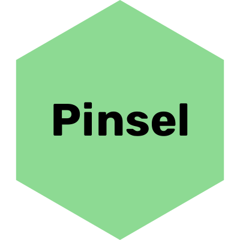

  

<h1 align="center">Pinsel.js</h1>
<h4 align="center">A lightweight, framework agnostic 2D drawing libary with focus on performance and developer experience.</h4>

  

  <a href="#key-features">TL;DR;</a> •
  <a href="#concept">How To Use</a> •
  <a href="#how-to-use">How To Use</a> •
  <a href="#download">Download</a> •
  <a href="#credits">Credits</a> •
  <a href="#related">Related</a> •
  <a href="#license">License</a>

